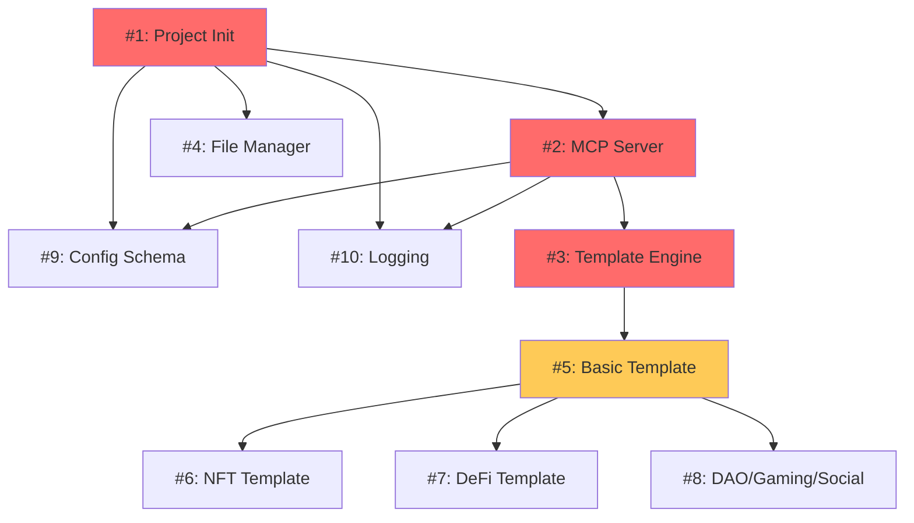
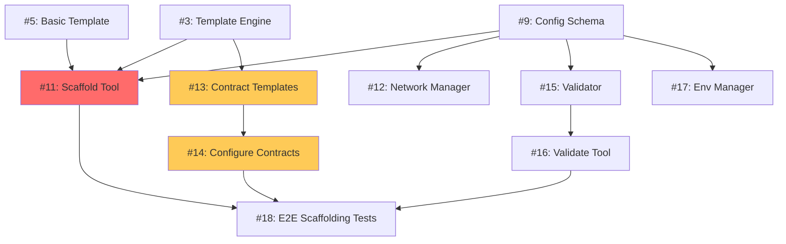
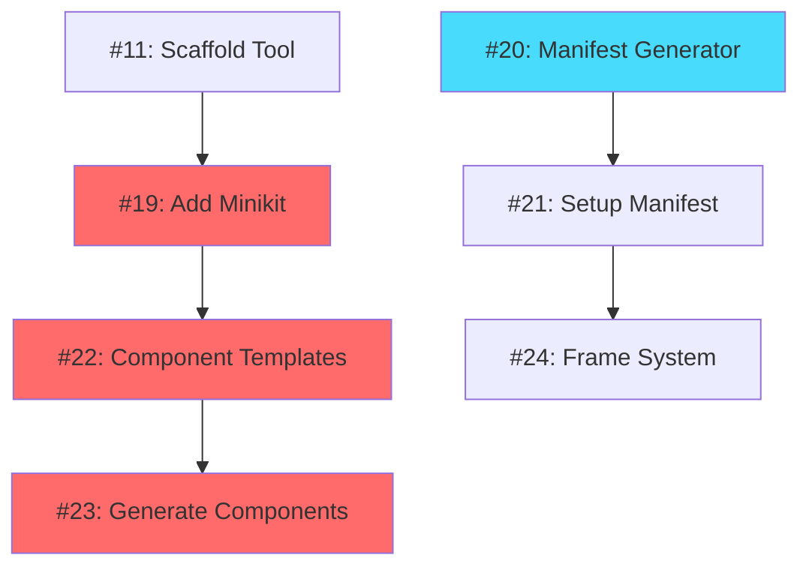
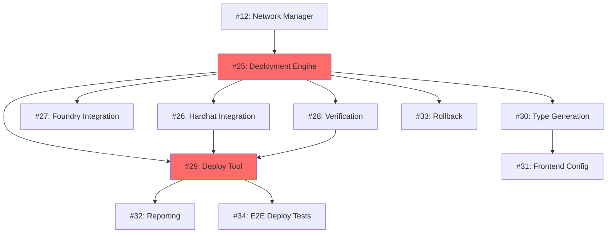
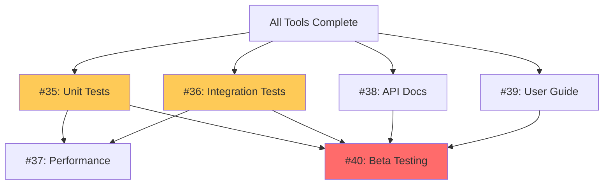
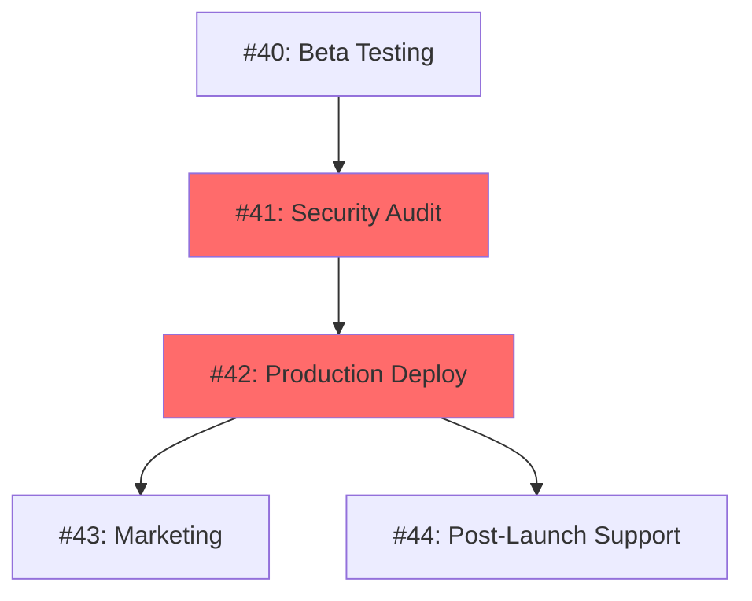
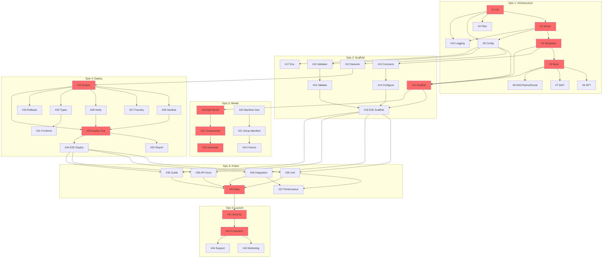

# SE2-Minikit MCP Server - Dependency Mapping

**Version**: 1.0
**Last Updated**: 2025-11-06

This document visualizes dependencies between implementation issues to enable efficient parallel development and identify the critical path.

## Table of Contents

- [Critical Path Analysis](#critical-path-analysis)
- [Epic Dependency Maps](#epic-dependency-maps)
- [Parallel Work Streams](#parallel-work-streams)
- [Blocking Dependencies](#blocking-dependencies)
- [Quick Reference Tables](#quick-reference-tables)

---

## Critical Path Analysis

### Longest Dependency Chain (Critical Path)

The critical path determines the minimum project duration. This path **cannot be parallelized** and represents ~6 weeks if dependencies are strictly followed:

```
#1 → #2 → #3 → #5 → #11 → #19 → #22 → #23
(8 weeks sequential, but some can overlap with careful planning)
```

**Breakdown**:

```
Week 1-2: Foundation
#1 (Project Init, 3pt, 2d)
  ↓
#2 (MCP Server, 5pt, 3d)
  ↓
#3 (Template Engine, 8pt, 4d)
  ↓
#5 (Basic Template, 5pt, 2d)

Week 3-4: Scaffolding
#11 (Scaffold Tool, 8pt, 4d)

Week 5-6: Minikit
#19 (Add Minikit, 8pt, 4d)
  ↓
#22 (Components, 8pt, 3d)
  ↓
#23 (Generate Components, 5pt, 2d)
```

**Total Critical Path Duration**: ~6-7 weeks if done sequentially

**Optimization Opportunity**: Overlap template work (#6, #7, #8) with infrastructure (#11, #12) to save 1-2 weeks.

---

## Epic Dependency Maps

### Epic 1: Core Infrastructure (Weeks 1-2)



**Parallel Streams**:
- **Stream 1** (Critical): #1 → #2 → #3 → #5
- **Stream 2**: #1 → #4, #9, #10 (can run in parallel after #1)
- **Stream 3**: #5 → #6, #7, #8 (all templates can be built in parallel)

**Optimal Staffing**: 3 developers
- Dev 1: Critical path (#1 → #2 → #3 → #5)
- Dev 2: Utilities (#4, #9, #10)
- Dev 3: Templates (#6, #7, #8)

---

### Epic 2: Scaffold & Configuration (Weeks 3-4)



**Parallel Streams**:
- **Stream 1** (Critical): #11 → #14 → #16 → #18
- **Stream 2**: #12, #13, #15, #17 (utilities, can run in parallel)

**Optimal Staffing**: 2-3 developers
- Dev 1: Critical path (#11, #14, #16)
- Dev 2: Network & validation (#12, #15, #17)
- Dev 3: Contract templates & tests (#13, #18)

---

### Epic 3: Minikit Integration (Weeks 5-6)



**Parallel Streams**:
- **Stream 1** (Critical): #19 → #22 → #23
- **Stream 2**: #20 → #21 → #24 (manifest system, independent)

**Optimal Staffing**: 2 developers
- Dev 1: Minikit tools (#19, #22, #23)
- Dev 2: Farcaster integration (#20, #21, #24)

---

### Epic 4: Deployment Pipeline (Weeks 7-8)



**Parallel Streams**:
- **Stream 1** (Critical): #25 → #29 → #34
- **Stream 2**: #25 → #26, #27, #28 (framework integrations)
- **Stream 3**: #30 → #31, #32, #33 (utilities)

**Optimal Staffing**: 3 developers
- Dev 1: Core deployment (#25, #29, #34)
- Dev 2: Framework integration (#26, #27, #28)
- Dev 3: Post-deployment (#30, #31, #32, #33)

---

### Epic 5: Polish & Testing (Weeks 9-10)



**Parallel Streams**:
- **Stream 1**: #35, #36 (testing)
- **Stream 2**: #38, #39 (documentation)
- **Sequential**: #37 (needs test results), #40 (needs everything)

**Optimal Staffing**: 2-3 developers
- Dev 1: Testing (#35, #36, #37)
- Dev 2: Documentation (#38, #39)
- Dev 3: Beta program (#40)

---

### Epic 6: Launch (Weeks 11-12)



**Sequential Flow**: Must be done in order for production safety.

**Optimal Staffing**: 2-3 developers + marketing
- Dev 1: Security & deployment (#41, #42)
- Dev 2: Support (#44)
- Marketing: Launch materials (#43)

---

## Parallel Work Streams

### Maximum Parallelization Opportunities

#### Week 1 (Epic 1, Part 1)
```
Developer 1: #1 → #2
Developer 2: #1 → #4
Developer 3: #1 → #9, #10
```
**3 parallel streams** after #1 completes

#### Week 2 (Epic 1, Part 2)
```
Developer 1: #2 → #3 → #5
Developer 2: #4 completion, start #6
Developer 3: #9, #10 completion, start #7
Developer 4 (optional): #8
```
**Up to 4 parallel streams** for template creation

#### Week 3-4 (Epic 2)
```
Developer 1: #11 (critical path)
Developer 2: #12, #13
Developer 3: #15, #17
```
**3 parallel streams**

#### Week 5-6 (Epic 3)
```
Developer 1: #19 → #22 → #23
Developer 2: #20 → #21 → #24
```
**2 parallel streams**

#### Week 7-8 (Epic 4)
```
Developer 1: #25 → #29
Developer 2: #26, #27
Developer 3: #28, #30 → #31
Developer 4 (optional): #32, #33
```
**3-4 parallel streams**

#### Week 9-10 (Epic 5)
```
Developer 1: #35
Developer 2: #36
Developer 3: #38, #39
(Then converge for #37, #40)
```
**3 parallel streams** initially

#### Week 11-12 (Epic 6)
```
Sequential: #41 → #42 → (#43 || #44)
```
**1-2 streams** (minimal parallelization for safety)

---

## Blocking Dependencies

### Issues Blocking Multiple Other Issues

These are "bottleneck" issues that block significant downstream work:

| Issue | Blocks | Impact |
|-------|--------|--------|
| **#1: Project Init** | #2, #4, #9, #10 | 🔴 Blocks entire project |
| **#2: MCP Server** | #3, #9, #10 | 🔴 Blocks all tools |
| **#3: Template Engine** | #5, #11, #13 | 🔴 Blocks scaffolding |
| **#5: Basic Template** | #6, #7, #8, #11 | 🟡 Blocks template work |
| **#11: Scaffold Tool** | #18, #19 | 🟡 Blocks Minikit |
| **#25: Deployment Engine** | #26, #27, #28, #29, #30, #33 | 🔴 Blocks entire deployment |
| **All Tools** | #35, #36, #38, #39 | 🔴 Blocks testing/docs |
| **#40: Beta Testing** | #41 | 🟡 Blocks launch |

### Issues with No Dependencies (Start Immediately)

These can start as soon as Epic begins:

**Epic 1**:
- #4 (File Manager) - after #1
- #9 (Config Schema) - after #1
- #10 (Logging) - after #1

**Epic 2**:
- #12 (Network Manager) - after #9
- #13 (Contract Templates) - after #3
- #15 (Validator) - after #9
- #17 (Env Manager) - after #9

**Epic 3**:
- #20 (Manifest Generator) - standalone

**Epic 4**:
- #26, #27, #28, #30, #32, #33 - after #25

**Epic 5**:
- #35, #36, #38, #39 - after all tools complete

---

## Quick Reference Tables

### Issue Dependency Matrix

| Issue | Depends On | Blocks | Parallel Safe |
|-------|------------|--------|---------------|
| #1 | None | #2, #4, #9, #10 | ✅ Start immediately |
| #2 | #1 | #3, #9, #10 | ❌ Critical path |
| #3 | #2 | #5, #11, #13 | ❌ Critical path |
| #4 | #1 | None | ✅ Parallel with #2 |
| #5 | #3 | #6, #7, #8, #11 | ❌ Critical path |
| #6 | #5 | None | ✅ Parallel with #7, #8 |
| #7 | #5 | None | ✅ Parallel with #6, #8 |
| #8 | #5 | None | ✅ Parallel with #6, #7 |
| #9 | #1, #2 | #11, #12, #15, #17 | ✅ Parallel with #3, #10 |
| #10 | #1, #2 | None | ✅ Parallel with #3, #9 |
| #11 | #3, #5, #9 | #18, #19 | ❌ Critical path |
| #12 | #9 | #25 | ✅ Parallel with #11, #13 |
| #13 | #3 | #14 | ✅ Parallel with #11, #12 |
| #14 | #13 | #18 | ❌ After #13 |
| #15 | #9 | #16 | ✅ Parallel with #11-#14 |
| #16 | #15 | #18 | ❌ After #15 |
| #17 | #9 | None | ✅ Parallel with others |
| #18 | #11, #14, #16 | None | ❌ End of Epic 2 |
| #19 | #11 | #22 | ❌ Critical path |
| #20 | None | #21 | ✅ Parallel with #19 |
| #21 | #20 | #24 | ❌ After #20 |
| #22 | #19 | #23 | ❌ Critical path |
| #23 | #22 | None | ❌ Critical path |
| #24 | #21 | None | ✅ Parallel with #22, #23 |
| #25 | #12 | #26-#29, #30, #33 | ❌ Critical path |
| #26 | #25 | #29 | ✅ Parallel with #27, #28 |
| #27 | #25 | #29 | ✅ Parallel with #26, #28 |
| #28 | #25 | #29 | ✅ Parallel with #26, #27 |
| #29 | #25, #26, #28 | #32, #34 | ❌ Critical path |
| #30 | #25 | #31 | ✅ Parallel with #26-#28 |
| #31 | #30 | None | ❌ After #30 |
| #32 | #29 | None | ✅ Parallel with #33, #34 |
| #33 | #25 | None | ✅ Parallel with #26-#32 |
| #34 | #29 | None | ❌ End of Epic 4 |
| #35 | All tools | #37, #40 | ✅ Parallel with #36, #38, #39 |
| #36 | All tools | #37, #40 | ✅ Parallel with #35, #38, #39 |
| #37 | #35, #36 | #40 | ❌ After #35, #36 |
| #38 | All tools | #40 | ✅ Parallel with #35, #36, #39 |
| #39 | All tools | #40 | ✅ Parallel with #35, #36, #38 |
| #40 | #35-#39 | #41 | ❌ End of Epic 5 |
| #41 | #40 | #42 | ❌ Sequential |
| #42 | #41 | #43, #44 | ❌ Sequential |
| #43 | #42 | None | ✅ Parallel with #44 |
| #44 | #42 | None | ✅ Parallel with #43 |

### Complexity vs Dependencies

| Complexity | High Dependencies | Low Dependencies |
|------------|------------------|------------------|
| **High (13pt)** | #7 (DeFi), #8 (DAO/Gaming), #25 (Deploy), #35 (Unit Tests) | None |
| **Medium (5-8pt)** | #3 (Templates), #11 (Scaffold), #14 (Configure), #19 (Minikit), #22 (Components), #29 (Deploy Tool) | #4 (Files), #6 (NFT), #9 (Config), #13 (Contracts), #20 (Manifest) |
| **Low (3pt)** | None | #1 (Init), #10 (Logging), #17 (Env), #32 (Reporting) |

**Strategy**:
- **High complexity + high dependencies**: Assign to senior developers early
- **High complexity + low dependencies**: Great for parallel work by experienced developers
- **Low complexity + low dependencies**: Perfect for new contributors

---

## Visual Dependency Graph (Mermaid)

### Complete Project Dependency Flow



**Legend**:
- 🔴 Red boxes: Critical path issues
- → Arrows: Dependencies

---

## Dependency Analysis Tools

### Identifying Ready-to-Start Issues

Use this query on your project board:

```
is:issue is:open no:assignee
-label:blocked
(label:p0-critical OR label:p1-high)
```

### Identifying Blockers

```
is:issue is:open label:blocked
```

### Tracking Epic Progress

```
is:issue label:epic-1-infrastructure
```

---

## Risk Mitigation

### High-Risk Dependencies

| Risk | Impact | Mitigation |
|------|--------|------------|
| #2 (MCP Server) delayed | 🔴 Blocks entire project | Start immediately, assign senior dev |
| #3 (Template Engine) buggy | 🔴 Blocks scaffolding | Comprehensive unit tests, early validation |
| #25 (Deploy Engine) complex | 🔴 Blocks deployment | Allocate extra time, multiple reviewers |
| #11 (Scaffold) incomplete | 🟡 Blocks Minikit | Define clear acceptance criteria |
| Beta testing (#40) reveals major issues | 🟡 Delays launch | Allocate 1-week buffer |

---

## Optimization Strategies

### Reducing Critical Path

1. **Overlap Template Work**: Start #6, #7, #8 as soon as #5 is functional (don't wait for polish)
2. **Parallel Framework Integration**: #26 and #27 can be done by different developers
3. **Early Documentation**: Start #38, #39 during Epic 4 (don't wait for Epic 5)
4. **Continuous Testing**: Write tests alongside features, not after

### Maximizing Parallel Work

1. **Epic 1**: Assign 3 developers to parallel streams
2. **Epic 2**: Assign utilities (#12, #15, #17) to one developer while another focuses on critical path
3. **Epic 4**: Maximize parallelization with 3-4 developers on independent components
4. **Epic 5**: Start documentation early to free up developers for testing

---

## Next Steps

1. **Import to Project Management**: Use this dependency data to populate GitHub Projects or Jira
2. **Assign Initial Work**: Start with #1, then immediately parallel to #4, #9, #10
3. **Monitor Blockers**: Check blocked issues daily and prioritize unblocking
4. **Adjust as Needed**: Update dependencies if scope changes or issues split/merge

---

**Document Maintained By**: Project Lead
**Last Review**: 2025-11-06
**Next Review**: Weekly during active development
